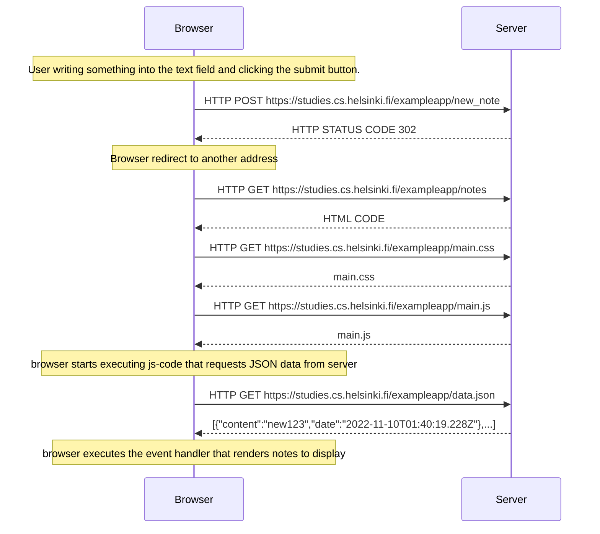

```mermaid
sequenceDiagram
note over Browser : User writing something into the text field and clicking the submit button.
Browser ->> Server : HTTP POST https://studies.cs.helsinki.fi/exampleapp/new_note
Server -->> Browser : HTTP STATUS CODE 302
note over Browser : Browser redirect to another address
Browser ->> Server : HTTP GET https://studies.cs.helsinki.fi/exampleapp/notes
Server -->> Browser : HTML CODE
Browser ->> Server : HTTP GET https://studies.cs.helsinki.fi/exampleapp/main.css
Server -->> Browser : main.css
Browser ->> Server : HTTP GET https://studies.cs.helsinki.fi/exampleapp/main.js
Server -->> Browser : main.js
note over Browser : browser starts executing js-code that requests JSON data from server 
Browser ->> Server : HTTP GET https://studies.cs.helsinki.fi/exampleapp/data.json
Server -->> Browser : [{"content":"new123","date":"2022-11-10T01:40:19.228Z"},...]
note over Browser: browser executes the event handler that renders notes to display

```

