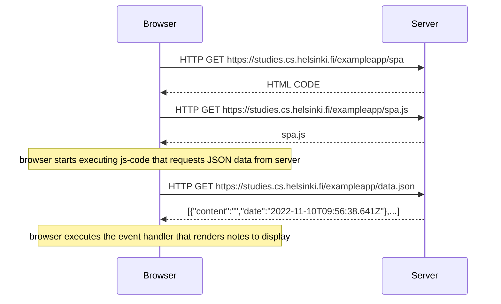

```mermaid
sequenceDiagram
Browser ->> Server : HTTP GET https://studies.cs.helsinki.fi/exampleapp/spa
Server -->> Browser : HTML CODE
Browser ->> Server : HTTP GET https://studies.cs.helsinki.fi/exampleapp/spa.js
Server -->> Browser : spa.js
note over Browser : browser starts executing js-code that requests JSON data from server 
Browser ->> Server : HTTP GET https://studies.cs.helsinki.fi/exampleapp/data.json
Server -->> Browser : [{"content":"","date":"2022-11-10T09:56:38.641Z"},...]
note over Browser : browser executes the event handler that renders notes to display


```

