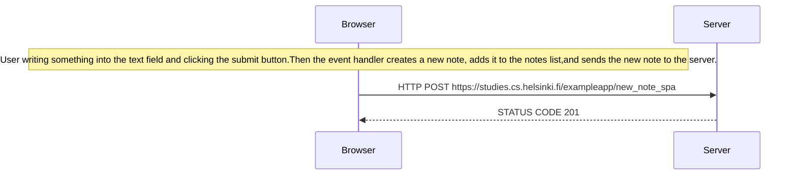

```mermaid
sequenceDiagram
note over Browser : User writing something into the text field and clicking the submit button.Then the event handler creates a new note, adds it to the notes list,and sends the new note to the server.
Browser ->> Server : HTTP POST https://studies.cs.helsinki.fi/exampleapp/new_note_spa
Server -->> Browser : STATUS CODE 201
```

